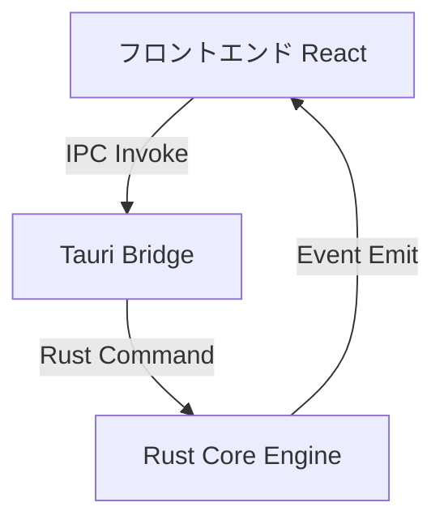
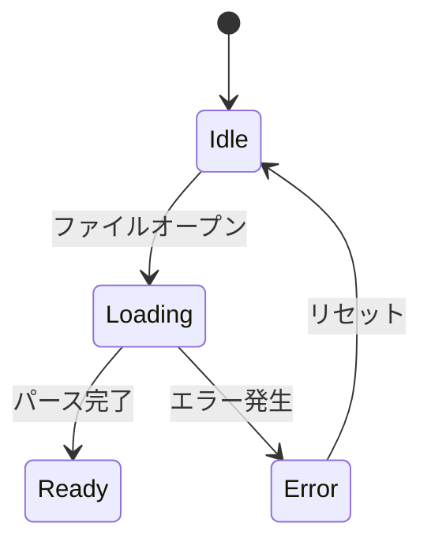
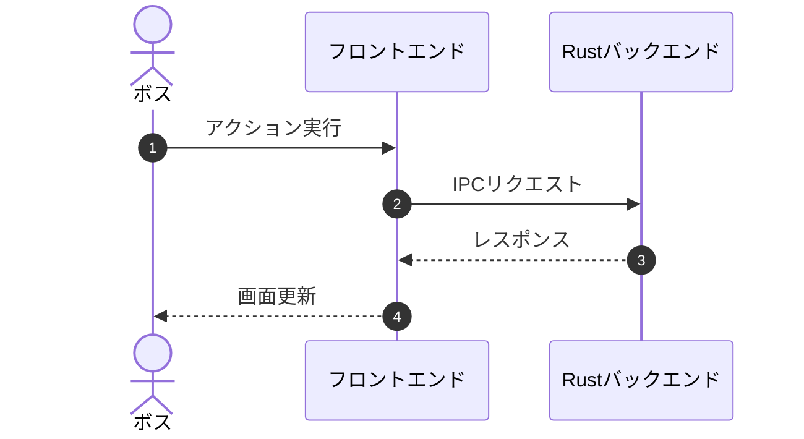

# Mermaid Diagram Authoring Guide

本スキルは、`QuMaEditor` における仕様書、設計書、実装計画書、ウォークスルー文書等でアーキテクチャや処理フローを視覚化する際のガイドラインです。

## 1. 作図方針

- **直感的な視覚化**: 複雑なモジュール連携や非同期通信（Tauri IPC、イベント等）は文章だけでなく図解を併用します。
- **記法統一**: Markdown 内で ````mermaid` コードブロックを使用します。

## 2. 主要ダイアグラム記法例

### アーキテクチャ / フロー図 (`flowchart TD / LR`)


### 状態遷移図 (`stateDiagram-v2`)


### シーケンス図 (`sequenceDiagram`)

