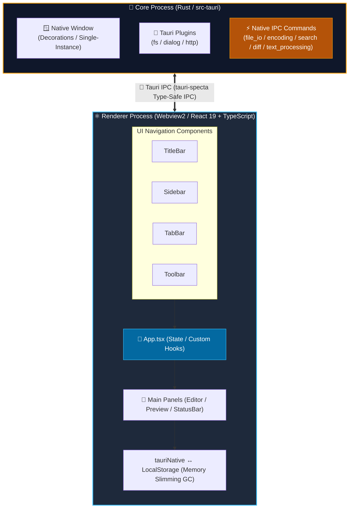
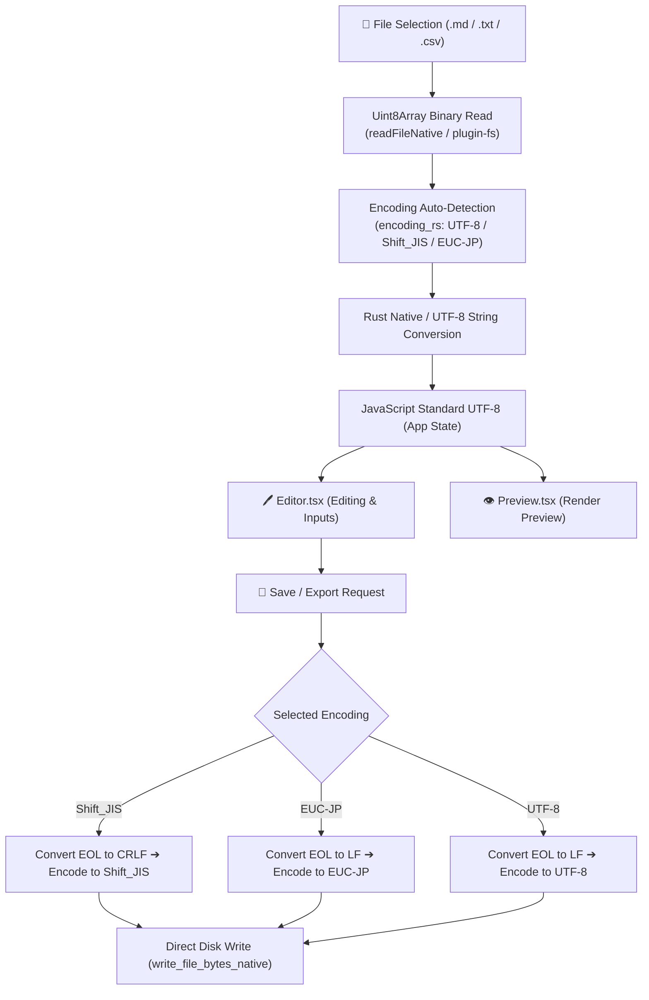

# Architecture Document (ARCHITECTURE)

**English** | [日本語版](../ja/ARCHITECTURE.md)

---

## 1. Process Model (Tauri Process Architecture)

This application adopts a multi-process desktop model powered by the Tauri v2 framework. The backend core process built in Rust communicates securely and efficiently with the Webview2 (React 19 + TypeScript) renderer process via IPC.

---

## 2. Character Encoding & Data Flow

Data processing flow for file imports and exports:

---

## 3. Persistence Architecture

- **Main Storage**: Browser `LocalStorage` key `markdown_editor_docs_v1` combined with Tauri native filesystem APIs.
- **Debounce Control**: Delayed writing via `autoSaveIntervalMs` (default 3000ms) timer to avoid performance degradation on every keystroke.
- **Memory Slimming GC**: Saved PC disk documents are converted to lightweight placeholders (`<!-- [STORAGE_SLIMMED_LOAD_FROM_DISK] -->`) during LocalStorage persistence to prevent `QuotaExceededError`.
- **Data Compatibility**: Preserves selected encoding configuration per document by persisting the `encoding` property in document state.

---

## 4. Backend Modular Architecture

```mermaid
graph TD
    subgraph Core["Tauri Application Entry"]
        Lib["lib.rs<br/>(Runner / Plugin Init / Specta Export)"]
        GenSpecta["bin/gen_specta.rs<br/>(TS Binding Generator)"]
    end

    subgraph CommandLayer["IPC Command Layer"]
        Commands["commands.rs<br/>(tauri::command / Specta DTO)"]
    end

    subgraph DomainModules["Domain Modules"]
        FileIO["file_io.rs<br/>(Native File I/O & Atomic Write)"]
        Encoding["encoding.rs<br/>(Multi-Encoding Detection)"]
        Search["search.rs<br/>(In-Memory & rayon Parallel Search)"]
        Diff["diff.rs<br/>(Text Diff & pulldown-cmark)"]
        TextProc["text_processing/<br/>(Stats, Headings, Formatter, HTML)"]
        Rope["rope_buffer.rs<br/>(ropey B-Tree Buffer)"]
        SyncMgr["sync_manager.rs<br/>(FileSyncManager)"]
        Watcher["file_watcher.rs<br/>(notify OS Watcher)"]
        ZipMod["export_zip.rs<br/>(zip Archive Deflate)"]
        ProofMod["proofreading.rs<br/>(Grammar & Markdown Lint)"]
        MermaidMod["mermaid_validator.rs<br/>(Syntax Check & Hash)"]
        MmapMod["mmap_reader.rs<br/>(memmap2 Zero-Copy)"]
        ScannerMod["workspace_scanner.rs<br/>(ignore Parallel Tree)"]
    end

    Lib --> Commands
    GenSpecta --> Commands
    Commands --> FileIO
    Commands --> Encoding
    Commands --> Search
    Commands --> Diff
    Commands --> TextProc
    Commands --> Rope
    Commands --> SyncMgr
    Commands --> Watcher
    Commands --> ZipMod
    Commands --> ProofMod
    Commands --> MermaidMod
    Commands --> MmapMod
    Commands --> ScannerMod
```

| Module Name         | File Path                                                                 | Responsibilities & Description                                                                                   |
| :------------------ | :------------------------------------------------------------------------ | :--------------------------------------------------------------------------------------------------------------- |
| `lib`               | [`src-tauri/src/lib.rs`](../../src-tauri/src/lib.rs)                      | Main entrypoint, plugin initialization, and Specta TypeScript binding generator handler                         |
| `commands`          | [`src-tauri/src/commands.rs`](../../src-tauri/src/commands.rs)            | IPC command handlers exposed to TypeScript and Specta macro mappings                                             |
| `encoding`          | [`src-tauri/src/encoding.rs`](../../src-tauri/src/encoding.rs)            | Multi-encoding auto-detection (UTF-8, Shift_JIS, EUC-JP) and conversion via `encoding_rs`                         |
| `file_io`           | [`src-tauri/src/file_io.rs`](../../src-tauri/src/file_io.rs)              | Native file reading, atomic file persistence, chunked streaming, direct byte writing, and folder opening        |
| `search`            | [`src-tauri/src/search.rs`](../../src-tauri/src/search.rs)                | Inverted index search engine and `rayon` multithreaded directory full-text search                                |
| `diff`              | [`src-tauri/src/diff.rs`](../../src-tauri/src/diff.rs)                    | Line-by-line and token-level diffing via `similar` crate and native Markdown HTML parsing via `pulldown-cmark`    |
| `text_processing`   | [`src-tauri/src/text_processing/`](../../src-tauri/src/text_processing/) | Text stats calculation, YAML front matter parser, heading outline, table alignment formatting, syntect HTML     |
| `rope_buffer`       | [`src-tauri/src/rope_buffer.rs`](../../src-tauri/src/rope_buffer.rs)      | `ropey` crate B-tree Rope buffer management ($O(\log N)$ edits, slicing, and chunking for 100MB+ files)           |
| `sync_manager`      | [`src-tauri/src/sync_manager.rs`](../../src-tauri/src/sync_manager.rs)    | `FileSyncManager` engine for disk mtime synchronization, self-save locks, and race condition prevention          |
| `file_watcher`      | [`src-tauri/src/file_watcher.rs`](../../src-tauri/src/file_watcher.rs)    | OS kernel-connected external file modification monitoring via the `notify` crate                                 |
| `export_zip`        | [`src-tauri/src/export_zip.rs`](../../src-tauri/src/export_zip.rs)        | Fast in-memory Deflate compression and batch ZIP export for documents and assets via `zip` crate                 |
| `proofreading`      | [`src-tauri/src/proofreading.rs`](../../src-tauri/src/proofreading.rs)    | Non-blocking asynchronous background analysis of duplicate particles, variant spellings, brackets, and lint rules |
| `mermaid_validator` | [`src-tauri/src/mermaid_validator.rs`](../../src-tauri/src/mermaid_validator.rs) | Mermaid syntax pre-validation, diagram type detection, and SHA-256 hash calculation for SVG diff caching        |
| `mmap_reader`       | [`src-tauri/src/mmap_reader.rs`](../../src-tauri/src/mmap_reader.rs)      | OS virtual memory page cache integration via `memmap2` for zero-copy instant opening of massive log files       |
| `workspace_scanner` | [`src-tauri/src/workspace_scanner.rs`](../../src-tauri/src/workspace_scanner.rs) | Multithreaded parallel directory tree traversal respecting `.gitignore` via `ignore` crate                       |

