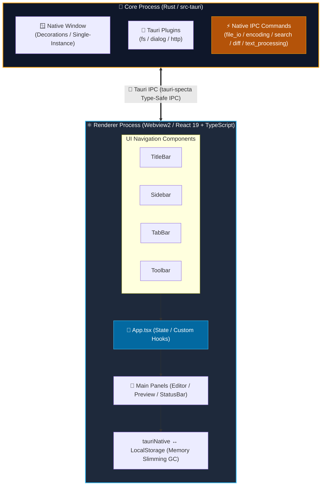
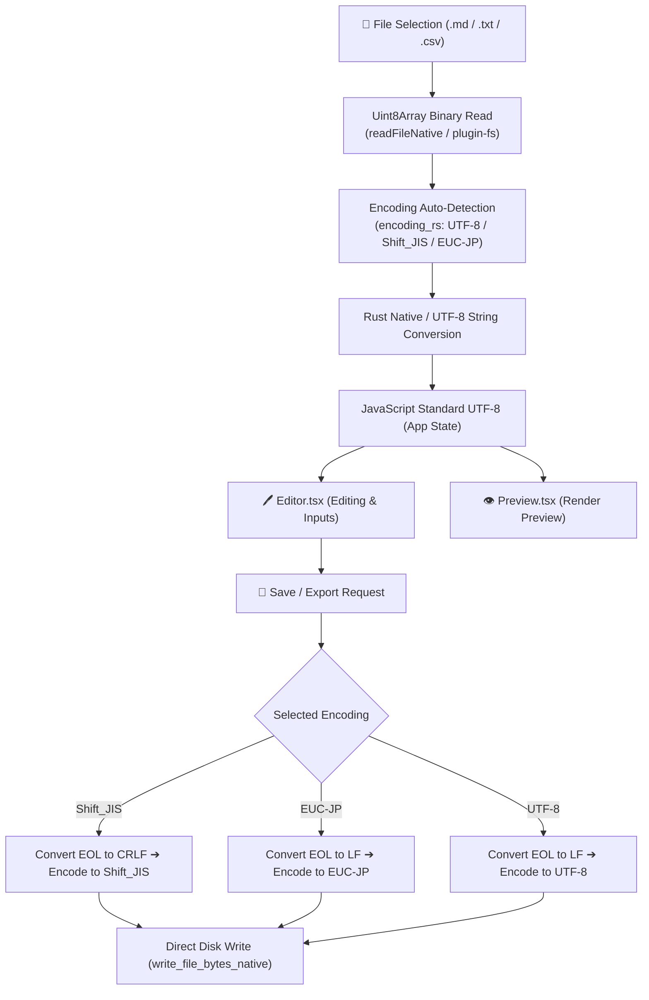
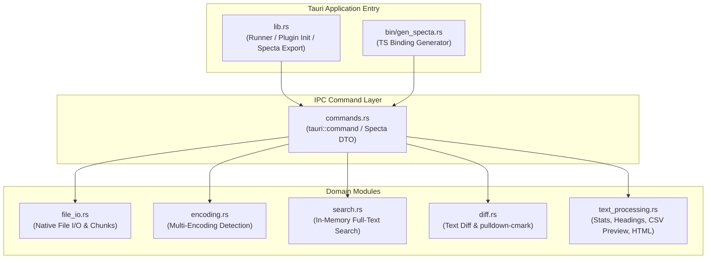

# Architecture Document (ARCHITECTURE)

**English** | [日本語版](../ja/ARCHITECTURE.md)

---

## 1. Process Model (Tauri Process Architecture)

This application adopts a multi-process desktop model powered by the Tauri v2 framework. The backend core process built in Rust communicates securely and efficiently with the Webview2 (React 19 + TypeScript) renderer process via IPC.

---

## 2. Character Encoding & Data Flow

Data processing flow for file imports and exports:

---

## 3. Persistence Architecture

- **Main Storage**: Browser `LocalStorage` key `markdown_editor_docs_v1` combined with Tauri native filesystem APIs.
- **Debounce Control**: Delayed writing via `autoSaveIntervalMs` (default 3000ms) timer to avoid performance degradation on every keystroke.
- **Memory Slimming GC**: Saved PC disk documents are converted to lightweight placeholders (`<!-- [STORAGE_SLIMMED_LOAD_FROM_DISK] -->`) during LocalStorage persistence to prevent `QuotaExceededError`.
- **Data Compatibility**: Preserves selected encoding configuration per document by persisting the `encoding` property in document state.

---

## 4. Backend Modular Architecture

| Module Name | File Path | Responsibilities & Description |
| :--- | :--- | :--- |
| `lib` | [`src-tauri/src/lib.rs`](file:///c:/Users/632792/Documents/自作/QuMaEditor/src-tauri/src/lib.rs) | Main entrypoint, plugin initialization, and Specta TypeScript binding generator handler |
| `commands` | [`src-tauri/src/commands.rs`](file:///c:/Users/632792/Documents/自作/QuMaEditor/src-tauri/src/commands.rs) | IPC command handlers exposed to TypeScript and Specta macro mappings |
| `encoding` | [`src-tauri/src/encoding.rs`](file:///c:/Users/632792/Documents/自作/QuMaEditor/src-tauri/src/encoding.rs) | Multi-encoding auto-detection (UTF-8, Shift_JIS, EUC-JP) and conversion via `encoding_rs` |
| `file_io` | [`src-tauri/src/file_io.rs`](file:///c:/Users/632792/Documents/自作/QuMaEditor/src-tauri/src/file_io.rs) | Native file reading, chunked streaming, direct byte writing, and Windows Explorer folder opening |
| `search` | [`src-tauri/src/search.rs`](file:///c:/Users/632792/Documents/自作/QuMaEditor/src-tauri/src/search.rs) | Fast inverted index search engine using `LazyLock<Mutex<Vec<DocSearchInput>>>` |
| `diff` | [`src-tauri/src/diff.rs`](file:///c:/Users/632792/Documents/自作/QuMaEditor/src-tauri/src/diff.rs) | Line-by-line text diffing via `similar` crate and native Markdown HTML parsing via `pulldown-cmark` |
| `text_processing` | [`src-tauri/src/text_processing.rs`](file:///c:/Users/632792/Documents/自作/QuMaEditor/src-tauri/src/text_processing.rs) | Text stats calculation, YAML front matter parser, heading outline, CSV fast preview, HTML export |
