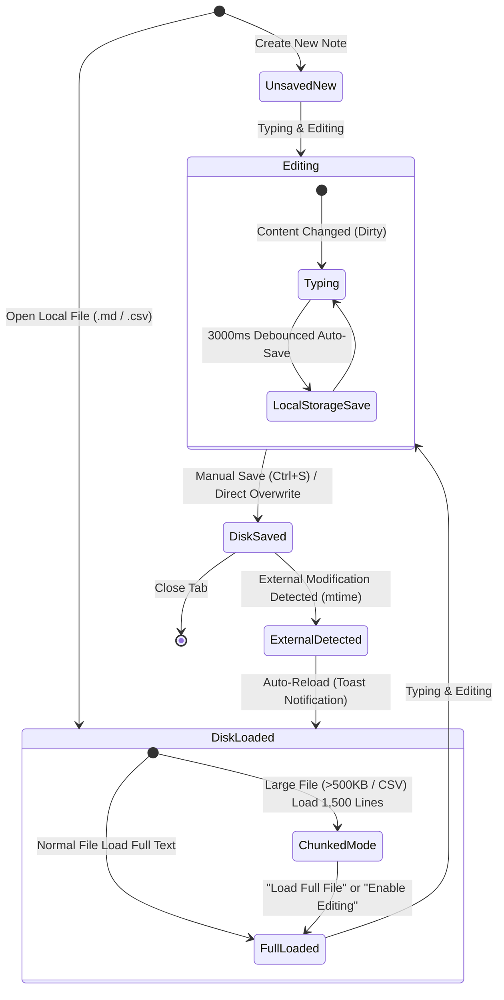

# Product Specification (SPECIFICATION)

Feature specifications and architecture overview for QuMaEditor.

---

## 1. Overview
QuMaEditor is an ultra-fast, lightweight desktop Markdown editor built with Tauri v2 + Rust backend and React + TypeScript frontend. (Current Version: v1.3.3)

---

## 2. Core Feature Specifications

### 2.1 Editor & Preview
- **Default Startup View**: Launches in Editor-only mode (`editor`), with instant toggling to split view (`split`) or preview-only (`preview`).
- **Selection-Based Text Formatting**: Toolbar buttons (`**bold**`, `*italic*`, `<u>underline</u>`, `~~strikethrough~~`) wrap highlighted text selections or insert at cursor position with automatic cursor position and focus restoration.
- **Cursor Line Heading Insertion**: Heading buttons (`H1`~`H3`) insert/replace `# ` / `## ` / `### ` markers at the beginning of the current cursor line instead of appending at the end of the document.
- **Ctrl + Scroll Wheel Preview Zoom**: Interactively zoom the preview rendering from 50% to 300% using `Ctrl + Scroll Wheel`. Displays a one-click reset badge in the top-right corner when zoomed.
- **Real-Time GFM Live Preview**: Full GFM support including GFM table alignments (left `:---`, center `:---:`, right `---:`), task lists, emojis, and code block syntax highlighting (`vscDarkPlus` / `prism`).
- **Protected YAML Front Matter**: Title, creation date, and encoding are auto-protected, while tags (`doc.tags`) can be interactively edited.
- **High-Contrast Theme System**: Seamless light/dark mode adaptation across all UI components, modals, scrollbars, and syntax highlighting.

### 2.2 Fast Search & Tag Search
- **Keyword Highlighting**: Matches in titles, body snippets, and search result lines are highlighted using vibrant amber badges (`<mark>`).
- **Front Matter Tag Search**: Instant document filtering by tag names (`#guide`, etc.) integrated into both JS filtering and Rust inverted index search.
- **Rust Inverted Index Search**: Native high-speed word index search for large document sets.

### 2.3 Printing & Direct PDF Export
- **Direct PDF Export**: One-click instant `.pdf` file generation and saving from preview rendering without invoking the browser print dialog.
- **A4 Full-Width Printing (`Ctrl + P`)**: All UI elements and editor panels are isolated using `print:hidden`, guaranteeing 100% page width printing of the rendered preview content.

### 2.4 File Saving & Dual Protection Architecture
- **Direct File Overwrite (`Ctrl + S`) & Save As (`Ctrl + Shift + S`)**: Integrated Tauri `dialog` / `fs` plugins and Rust native reader (`read_file_native`). Retains actual `.md` file path (`filePath`) and directly overwrites disk files during manual or auto-save.
- **Open Containing Folder in Explorer**: Native command (`open_folder_native`) in File menu to open the parent directory of active files directly in Windows Explorer.
- **Dual Protection & Crash Prevention (LocalStorage Safety)**: Automatically backs up editing contents to LocalStorage (`📦 App (LocalStorage) Saved`) every 3 seconds to prevent data loss during power outages or unexpected crashes. Visualized and explained in detail within the `AboutModal`.
- **Drag & Drop Local File Opening & Image Embedding**: Drag `.md` / `.txt` files directly from Windows File Explorer to open as new tabs with disk file path binding. Dropping image files automatically embeds them as Data URL Markdown tags. Supports batch multi-file drop processing.
- **Single Instance Enforcement**: Prevents duplicate app processes. Brings existing QuMaEditor window to focus and opens passed files as new tabs.
- **Windows Explorer Context Menu**: Automatically registers "Open with QuMaEditor" in Windows Explorer right-click context menu.
- **AppData Path & Storage Metrics**: Displays AppData path (with copy button), real-time KB/doc metrics, and one-click cache cleanup in `SettingsModal`. Danger action ("Full Data Reset") positioned at bottom-left footer to prevent accidental triggers.

### 2.5 Rust Native Acceleration
- **Chunked File Streaming**: Native streaming for 10MB+ files to prevent memory overload.
- **Multi-Threaded Encoding Batch Conversion**: Rayon-powered batch conversion to UTF-8 / Shift_JIS.
- **Text Diff Calculation**: Native line-by-line diff processing via `similar`.
- **Native Folder Explorer Opening**: Native command (`open_folder_native`) invoking Windows `explorer.exe`.

---

## 3. Document Lifecycle Architecture

---

## 4. System Requirements

| Item | Details |
| :--- | :--- |
| Version | v1.4.0 |
| OS | Windows 10 / 11 (Tauri v2 Native Window) |
| Runtime | Rust Native Engine + WebView2 |

