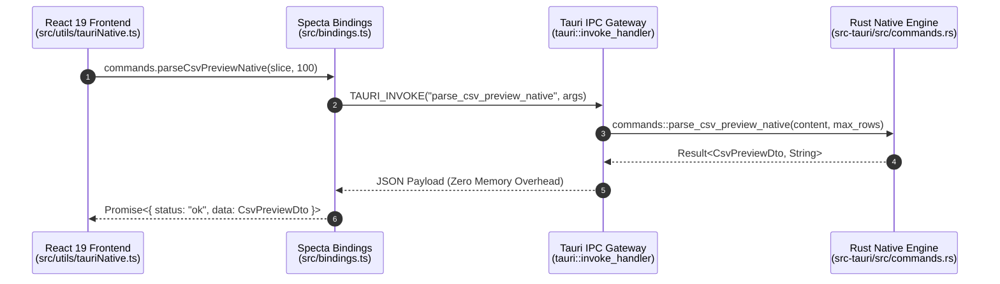

# Tauri v2 IPC Development & Test Guide (TAURI_GUIDE)

**English** | [日本語版](docs/ja/TAURI_GUIDE.md)

## 1. Tauri v2 IPC Architecture

QuMaEditor utilizes high-speed **IPC (Inter-Process Communication)** between React 19 Frontend and Rust Backend Engine.

---

## 2. IPC Commands List & DTO Definitions

| Command Name                  | Arguments                                 | Return Type                  | Description                                                                  |
| :---------------------------- | :---------------------------------------- | :--------------------------- | :--------------------------------------------------------------------------- |
| `detect_and_convert_to_utf8`  | `bytes: Vec<u8>`                          | `Result<EncodingDetectResult>` | Auto-detect character encoding and decode to UTF-8 string                   |
| `convert_utf8_to_encoding`    | `text: String, target_encoding: String`   | `Result<Vec<u8>>`            | Encode UTF-8 text into target encoding byte vector                           |
| `read_file_native`            | `file_path: String`                       | `Result<EncodingDetectResult>` | Fast native file reader with encoding auto-detection                         |
| `read_file_chunk_native`      | `file_path: String, offset, length`       | `Result<FileChunkResult>`    | 10MB+ large file streaming in memory chunks                                  |
| `index_documents_native`      | `docs: Vec<DocSearchInput>`               | `Result<bool>`               | Batch registration to in-memory inverted search index                        |
| `search_documents_native`     | `query: String`                           | `Result<Vec<SearchResult>>`  | Inverted index full-text search with multibyte safety                        |
| `compute_text_diff_native`    | `old_text: String, new_text: String`      | `Result<Vec<TextDiffChunk>>` | Line-by-line diff calculation using `similar` crate                          |
| `parse_markdown_native`       | `markdown_text: String`                   | `Result<String>`             | Fast Markdown to HTML parser using `pulldown-cmark`                          |
| `write_file_bytes_native`     | `file_path: String, bytes: Vec<u8>`       | `Result<bool>`               | Direct byte array disk persistence                                           |
| `write_file_native`           | `file_path: String, content: String`      | `Result<bool>`               | Direct UTF-8 string disk persistence                                         |
| `calculate_text_stats_native` | `text: String`                            | `Result<TextStatsDto>`       | Real-time character, word, and reading time counter                          |
| `parse_yaml_front_matter_native` | `content: String`                      | `Result<YamlFrontMatterDto>` | Fast YAML front matter parsing and metadata extraction                       |
| `extract_headings_native`     | `markdown_text: String`                   | `Result<Vec<HeadingItemDto>>` | Extracts H1~H6 outline tree from Markdown text                               |
| `toggle_task_native`          | `markdown_text: String, line_num: usize`  | `Result<String>`             | Toggles task checkbox state (`- [ ]` ↔ `- [x]`) on specified line            |
| `export_html_full_native`     | `markdown_text: String, title: String`    | `Result<String>`             | Generates standalone HTML document with embedded CSS                         |
| `parse_csv_preview_native`    | `content: String, max_rows: usize`        | `Result<CsvPreviewDto>`      | Zero-copy line count and quote-aware cell extraction                         |
| `format_markdown_native`      | `markdown_text: String`                   | `Result<String>`             | Markdown auto-formatting (align tables, insert blank lines, collapse blanks) |
| `render_markdown_html_native` | `markdown_text: String, is_dark: bool`    | `Result<String>`             | syntect syntax highlighted HTML rendering                                    |
| `get_file_metadata_native`    | `file_path: String`                       | `Result<FileMetadataDto>`    | Fast retrieval of file existence, `mtime`, and byte size                     |
| `open_folder_native`          | `file_path: String`                       | `Result<bool>`               | Opens parent directory in Windows Explorer with file highlighted             |
