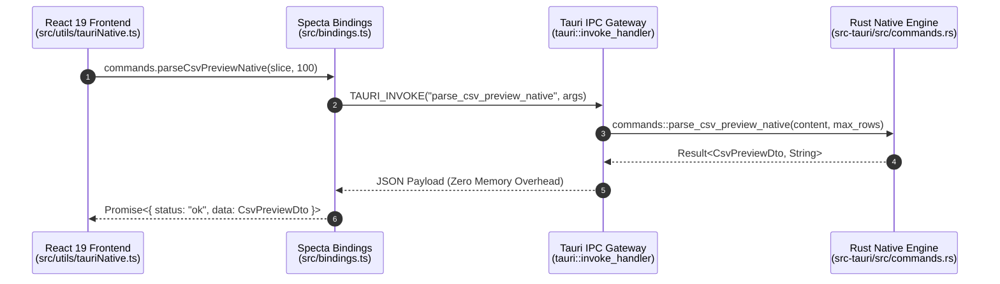

# Tauri v2 Development, IPC & Testing Guide (TAURI_GUIDE)

**English Version** | [日本語版](../ja/TAURI_GUIDE.md)

This document describes the **Tauri v2** native backend architecture, IPC communication protocols, capability security settings, and test suite guidelines for QuMaEditor.

---

## 1. Tauri v2 IPC Communication Architecture

QuMaEditor uses a high-performance **IPC (Inter-Process Communication)** bridge between the frontend (React 19 + TypeScript) and native Rust engine.



---

## 2. Native IPC Commands Summary

| Command | Arguments | Return Type | Description |
| :--- | :--- | :--- | :--- |
| `detect_and_convert_to_utf8` | `bytes: Vec<u8>` | `Result<EncodingDetectResult>` | Auto encoding detection & UTF-8 decoding |
| `convert_utf8_to_encoding` | `text: String, target_encoding: String` | `Result<Vec<u8>>` | Encodes text to Shift_JIS / EUC-JP bytes |
| `read_file_native` | `file_path: String` | `Result<EncodingDetectResult>` | Fast native file reading and encoding detection |
| `read_file_chunk_native` | `file_path: String, offset, length` | `Result<FileChunkResult>` | 10MB+ large file chunk streaming |
| `index_documents_native` | `docs: Vec<DocSearchInput>` | `Result<bool>` | In-memory inverted index batch registration |
| `search_documents_native` | `query: String` | `Result<Vec<SearchResult>>` | Multi-byte safe fast full-text keyword search |
| `compute_text_diff_native` | `old_text: String, new_text: String` | `Result<Vec<TextDiffChunk>>` | Line-by-line diff using `similar` crate |
| `parse_markdown_native` | `markdown_text: String` | `Result<String>` | Fast Markdown -> HTML via `pulldown-cmark` |
| `write_file_bytes_native` | `file_path: String, bytes: Vec<u8>` | `Result<bool>` | Raw byte array native disk writing |
| `write_file_native` | `file_path: String, content: String` | `Result<bool>` | UTF-8 string native disk writing |
| `calculate_text_stats_native` | `text: String` | `Result<TextStatsDto>` | Real-time character, word, and reading time stats |
| `parse_yaml_front_matter_native` | `full_text: String` | `Result<ParsedYamlDocResult>` | Fast YAML Front Matter & body separation |
| `extract_headings_native` | `markdown_text: String` | `Result<Vec<HeadingItemDto>>` | Instant H1-H6 outline table of contents tree |
| `toggle_task_native` | `markdown_text: String, target_index: u32`| `Result<String>` | Fast checkbox cycling & status toggle |
| `export_html_full_native` | `title, markdown_text, is_dark` | `Result<String>` | Standalone complete HTML document export |
| `parse_csv_preview_native` | `content: String, max_rows: u32` | `Result<CsvPreviewDto>` | Zero-copy CSV row counting and quoted cell extraction |
| `get_file_metadata_native` | `file_path: String` | `Result<FileMetadataDto>` | File existence, modification timestamp (mtime), size |
| `open_folder_native` | `file_path: String` | `Result<bool>` | Opens Explorer and highlights target file |le         |

---

## 3. Capabilities & Permissions

Tauri v2 manages system capabilities strictly via `src-tauri/capabilities/default.json`:

```json
{
  "$schema": "../node_modules/@tauri-apps/cli/config.schema.json",
  "identifier": "default",
  "description": "QuMaEditor default permissions",
  "windows": ["main"],
  "permissions": [
    "core:default",
    "dialog:default",
    "fs:default",
    "http:default"
  ]
}
```

---

## 4. Tauri Testing Guide

Testing Tauri desktop applications involves three layers:

1. **Rust Backend Unit Tests (`cargo test`)**: Verify core functions and DTO serialization.
2. **Frontend Tauri IPC Bridge Mocks (Vitest / Jest)**: Mock `window.__TAURI_INTERNALS__` to test wrapper functions in `src/utils/tauriNative.ts`.
3. **E2E Graphical UI Tests (Playwright / WebdriverIO)**: Automate WebView2 window interactions and user flows.
