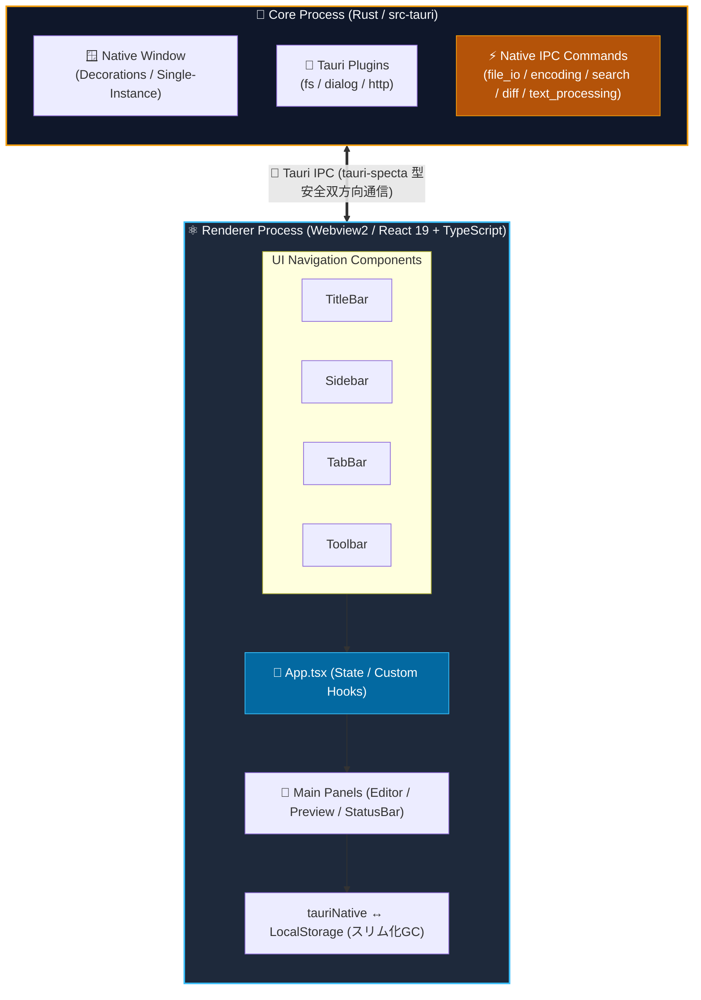
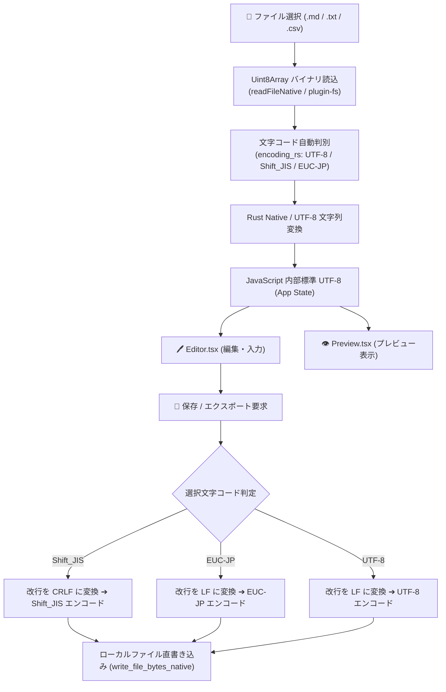

# アーキテクチャ設計書 (ARCHITECTURE)

[English Version](../en/ARCHITECTURE.md) | **日本語版**

---

## 1. 全体プロセスモデル (Tauri Process Architecture)

本アプリケーションは、Tauri v2 フレームワークを採用したマルチプロセス型のデスクトップアプリケーションです。Rust で構築されたバックエンドコアプロセスと、Webview2 (React 19 + TypeScript) で構築されたレンダラープロセスが安全かつ高速な IPC 通信を行って連携します。

---

## 2. 文字コード判別＆データフロー

ファイルインポート・エクスポート時のデータ処理フローは以下の通りです。

---

## 3. 永続化設計 (Persistence Architecture)

- **主ストレージ**: ブラウザの `LocalStorage` キー `markdown_editor_docs_v1` および Tauri ネイティブファイルシステム連携
- **デバウンス制御**: タイプ毎に LocalStorage に即時書き込みを行うとパフォーマンスが低下するため、`autoSaveIntervalMs`（標準値 3000ms）のタイマー制御により遅延書き込みを適用。
- **自動ストレージスリム化 (Memory Slimming GC)**: PC 上の実ファイルに保存済みのドキュメントは LocalStorage 保存時に軽量プレースホルダー (`<!-- [STORAGE_SLIMMED_LOAD_FROM_DISK] -->`) へ自動圧縮し、LocalStorage の容量オーバー (`QuotaExceededError`) を永久に防止。
- **データ互換性**: ドキュメントデータ構造に `encoding` プロパティを持たせることで、ドキュメントごとの選択文字コード設定を永続化。

---

## 4. Rust ネイティブコマンド拡張 (Native Commands)

| コマンド名                    | 概要                                                                                                  |
| :---------------------------- | :---------------------------------------------------------------------------------------------------- |
| `read_file_native`            | 権限制限を受けずに高速・確実にローカルディスクからファイルを直読み込み                                |
| `read_file_chunk_native`      | 大容量ファイルを指定オフセットから部分ストリーミング読み込み（遅延ロード）                            |
| `write_file_native`           | 指定ファイルパスへの UTF-8 テキスト直接上書き保存を実行                                               |
| `write_file_bytes_native`     | 指定文字コードにエンコードされた生バイト列を直接ディスクへ保存                                        |
| `get_file_metadata_native`    | ファイルの存在有無、最終更新日時 (`mtime`)、ファイルサイズを高速取得                                  |
| `open_folder_native`          | 対象ファイルの親フォルダを Windows エクスプローラー (`explorer.exe`) で直接オープンしハイライト選択  |
| `search_documents_native`     | メモリ上転置インデックスを用いた Rust 高速全文検索                                                    |
| `parse_markdown_native`       | `pulldown-cmark` による高速 Markdown 構文解析                                                         |
| `compute_text_diff_native`    | `similar` クレートによるリアルタイム行単位・単語単位差分計算                                          |
| `calculate_text_stats_native` | リアルタイム文字数・単語数・行数・読了目安時間の高速ネイティブ計算                                    |
| `parse_yaml_front_matter_native` | YAML Front Matter と本文の高速分離・メタデータパース                                               |
| `extract_headings_native`     | Markdown から H1〜H6 見出しアウトラインツリーを高速抽出                                               |
| `toggle_task_native`          | タスクチェックボックス状態の高速トグル                                                                |
| `format_markdown_native`      | 表組み垂直整列・過剰空行圧縮・見出し空行自動挿入の高速ネイティブ自動整形                              |
| `render_markdown_html_native` | `syntect` によるプログラミング構文ハイライト付き高速 HTML レンダリング                                |
| `export_html_full_native`     | 完全スタンドアロン HTML エクスポートドキュメント生成                                                  |
| `atomic_write_file_native`    | 一時ファイル先行書込＆アトミックリネームによる破損防止 UTF-8 保存（mtime 保証）                      |
| `atomic_write_file_bytes_native` | 生バイト列のアトミック書き込み保存（mtime 保証）                                                   |
| `search_workspace_dir_native` | `rayon` によるディレクトリ内全ファイル並列走査・高速全文検索                                          |
| `rope_init_buffer` 等         | `ropey` による大容量テキスト Bツリー Rope バッファ管理（部分抽出・行スライス・高速編集）             |
| `sync_register_file` 等       | `FileSyncManager` による実ファイル mtime・自プロセス保存ロック・双方向同期一元管理                   |
| `watch_file_native` 等        | `notify` クレートによる OS カーネル直結の外部ファイル変更監視・自動フィルタリング                     |
| `compute_detailed_diff_native` | `similar` クレートによる行番号・単語レベルインライン差分（`inline_changes`）の爆速計算               |
| `export_notes_to_zip_native`  | `zip` クレート（Deflate 圧縮）による複数ノート・アセットの一括 ZIP アーカイブ出力                     |
| `lint_markdown_document_native` | 連続助詞・表記ゆれ・未閉じ括弧/コードブロックの非同期バックグラウンド校正                             |
| `validate_mermaid_syntax_native` | Mermaid ダイアグラム構文事前検証 ＆ SHA-256 ハッシュによる SVG インメモリ差分キャッシュ最適化        |
| `mmap_read_file_chunk_native` | `memmap2` クレートによる OS 仮想メモリ直結・超巨大ファイルゼロコピー瞬時オープン                      |
| `scan_workspace_tree_native`  | `ignore` クレートによる .gitignore 準拠マルチスレッド並列ファイルツリー走査                          |

---

## 5. バックエンドモジュール構造 (Modular Architecture)

```mermaid
graph TD
    subgraph Core["Tauri Application Entry"]
        Lib["lib.rs<br/>(Runner / Plugin Init / Specta Export)"]
        GenSpecta["bin/gen_specta.rs<br/>(TS Binding Generator)"]
    end

    subgraph CommandLayer["IPC コマンド定義層"]
        Commands["commands.rs<br/>(tauri::command / Specta DTO)"]
    end

    subgraph DomainModules["ドメイン機能モジュール"]
        FileIO["file_io.rs<br/>(Native File I/O & Atomic Write)"]
        Encoding["encoding.rs<br/>(Multi-Encoding Detection)"]
        Search["search.rs<br/>(In-Memory & rayon Parallel Search)"]
        Diff["diff.rs<br/>(Text Diff & pulldown-cmark)"]
        TextProc["text_processing/<br/>(Stats, Headings, Formatter, HTML)"]
        Rope["rope_buffer.rs<br/>(ropey B-Tree Buffer)"]
        SyncMgr["sync_manager.rs<br/>(FileSyncManager)"]
        Watcher["file_watcher.rs<br/>(notify OS Watcher)"]
        ZipMod["export_zip.rs<br/>(zip Archive Deflate)"]
        ProofMod["proofreading.rs<br/>(Grammar & Markdown Lint)"]
        MermaidMod["mermaid_validator.rs<br/>(Syntax Check & Hash)"]
        MmapMod["mmap_reader.rs<br/>(memmap2 Zero-Copy)"]
        ScannerMod["workspace_scanner.rs<br/>(ignore Parallel Tree)"]
    end

    Lib --> Commands
    GenSpecta --> Commands
    Commands --> FileIO
    Commands --> Encoding
    Commands --> Search
    Commands --> Diff
    Commands --> TextProc
    Commands --> Rope
    Commands --> SyncMgr
    Commands --> Watcher
    Commands --> ZipMod
    Commands --> ProofMod
    Commands --> MermaidMod
    Commands --> MmapMod
    Commands --> ScannerMod
```

| モジュール名        | ファイルパス                                                              | 役割・概要                                                                                            |
| :------------------ | :------------------------------------------------------------------------ | :---------------------------------------------------------------------------------------------------- |
| `lib`               | [`src-tauri/src/lib.rs`](../../src-tauri/src/lib.rs)                      | アプリケーションのエントリポイント、プラグイン登録、Specta型自動バインディング出力ハンドラー          |
| `commands`          | [`src-tauri/src/commands.rs`](../../src-tauri/src/commands.rs)            | フロントエンド (IPC) から受け取る全 Tauri コマンドハンドラーおよび Specta マッピング定義              |
| `encoding`          | [`src-tauri/src/encoding.rs`](../../src-tauri/src/encoding.rs)            | `encoding_rs` を用いた多言語文字コード (UTF-8, Shift_JIS, EUC-JP) 自動判定および相互変換             |
| `file_io`           | [`src-tauri/src/file_io.rs`](../../src-tauri/src/file_io.rs)              | ネイティブファイル直接読込・アトミック書き込み保存・大容量チャンク読込・エクスプローラー起動          |
| `search`            | [`src-tauri/src/search.rs`](../../src-tauri/src/search.rs)                | メモリ内転置インデックス検索 ＆ `rayon` によるディレクトリ内マルチスレッド並列全文検索               |
| `diff`              | [`src-tauri/src/diff.rs`](../../src-tauri/src/diff.rs)                    | `similar` クレートを用いた行単位・インライン単語単位 Diff 計算 ＆ `pulldown-cmark` ネイティブパース    |
| `text_processing`   | [`src-tauri/src/text_processing/`](../../src-tauri/src/text_processing/) | 統計計算、YAMLパース、見出し抽出、表組み垂直整列、`syntect` 構文ハイライト付き HTML レンダリング     |
| `rope_buffer`       | [`src-tauri/src/rope_buffer.rs`](../../src-tauri/src/rope_buffer.rs)      | `ropey` クレートによる Bツリー Rope バッファ管理（100MB級ファイルの $O(\log N)$ 高速編集・スライス）   |
| `sync_manager`      | [`src-tauri/src/sync_manager.rs`](../../src-tauri/src/sync_manager.rs)    | `FileSyncManager` による実ファイル同期、mtime 排他ロック、自プロセス保存状態の一元調停               |
| `file_watcher`      | [`src-tauri/src/file_watcher.rs`](../../src-tauri/src/file_watcher.rs)    | `notify` クレートを用いた OS カーネル直結の外部ファイル変更監視エンジン                               |
| `export_zip`        | [`src-tauri/src/export_zip.rs`](../../src-tauri/src/export_zip.rs)        | `zip` クレートを用いた複数ノート・画像アセットの一括 Deflate 圧縮 ZIP アーカイブ出力                |
| `proofreading`      | [`src-tauri/src/proofreading.rs`](../../src-tauri/src/proofreading.rs)    | 連続助詞・表記ゆれ・未閉じ括弧・未閉じコードブロックの非同期高速バックグラウンド構文解析              |
| `mermaid_validator` | [`src-tauri/src/mermaid_validator.rs`](../../src-tauri/src/mermaid_validator.rs) | Mermaid コードの構文事前検証、ダイアグラム種別判定、および SHA-256 ハッシュ計算による SVG キャッシュ最適化 |
| `mmap_reader`       | [`src-tauri/src/mmap_reader.rs`](../../src-tauri/src/mmap_reader.rs)      | `memmap2` を用いた OS 仮想メモリページキャッシュ直結・GB級巨大ファイルゼロコピー瞬時オープン        |
| `workspace_scanner` | [`src-tauri/src/workspace_scanner.rs`](../../src-tauri/src/workspace_scanner.rs) | `ignore` クレートを用いた .gitignore 準拠マルチスレッド並列ファイルツリー走査                        |

