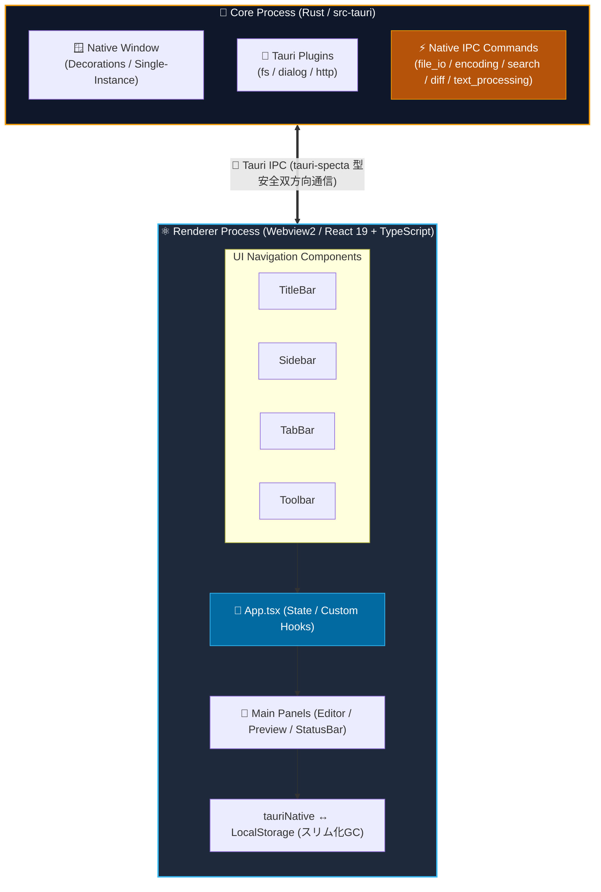
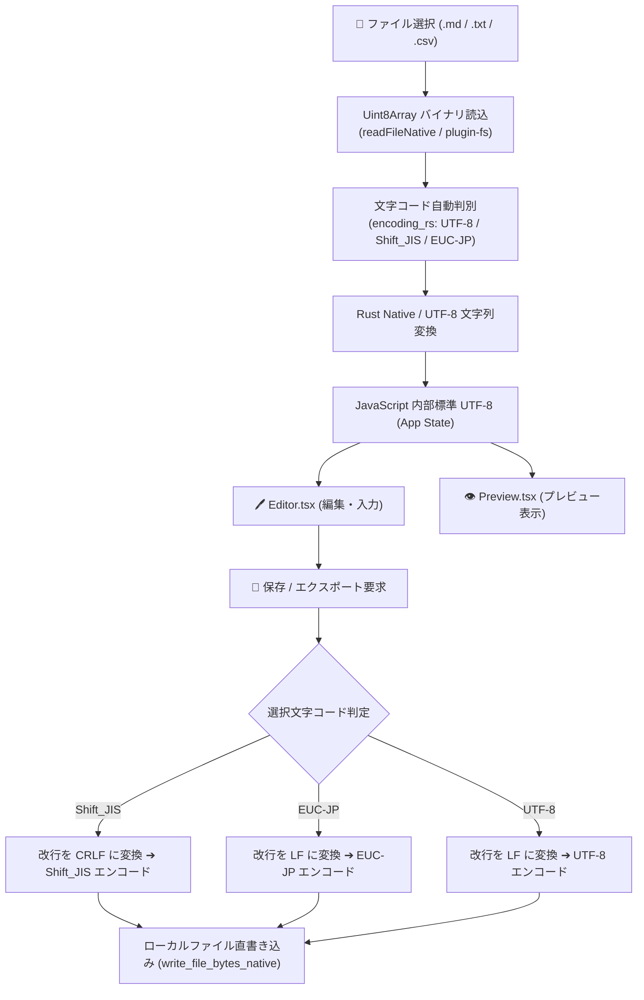
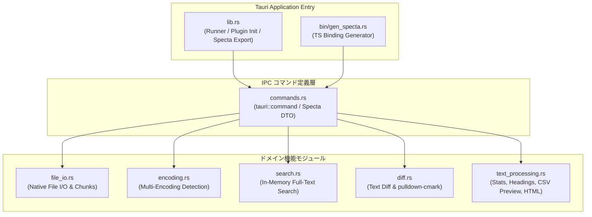

# アーキテクチャ設計書 (ARCHITECTURE)

[English Version](../en/ARCHITECTURE.md) | **日本語版**

---

## 1. 全体プロセスモデル (Tauri Process Architecture)

本アプリケーションは、Tauri v2 フレームワークを採用したマルチプロセス型のデスクトップアプリケーションです。Rust で構築されたバックエンドコアプロセスと、Webview2 (React 19 + TypeScript) で構築されたレンダラープロセスが安全かつ高速な IPC 通信を行って連携します。

---

## 2. 文字コード判別＆データフロー

ファイルインポート・エクスポート時のデータ処理フローは以下の通りです。

---

## 3. 永続化設計 (Persistence Architecture)

- **主ストレージ**: ブラウザの `LocalStorage` キー `markdown_editor_docs_v1` および Tauri ネイティブファイルシステム連携
- **デバウンス制御**: タイプ毎に LocalStorage に即時書き込みを行うとパフォーマンスが低下するため、`autoSaveIntervalMs`（標準値 3000ms）のタイマー制御により遅延書き込みを適用。
- **自動ストレージスリム化 (Memory Slimming GC)**: PC 上の実ファイルに保存済みのドキュメントは LocalStorage 保存時に軽量プレースホルダー (`<!-- [STORAGE_SLIMMED_LOAD_FROM_DISK] -->`) へ自動圧縮し、LocalStorage の容量オーバー (`QuotaExceededError`) を永久に防止。
- **データ互換性**: ドキュメントデータ構造に `encoding` プロパティを持たせることで、ドキュメントごとの選択文字コード設定を永続化。

---

## 4. Rust ネイティブコマンド拡張 (Native Commands)

| コマンド名 | 概要 |
| :--- | :--- |
| `read_file_native` | 権限制限を受けずに高速・確実にローカルディスクからファイルを直読み込み |
| `read_file_chunk_native` | 大容量ファイルを指定オフセットから部分ストリーミング読み込み（遅延ロード） |
| `write_file_native` | ダイアログ許可範囲外の元ファイルパスへの直接上書き保存を実行 |
| `write_file_bytes_native` | 指定文字コードにエンコードされた生バイト列を直接ディスクへ保存 |
| `get_file_metadata_native` | ファイルの存在有無、最終更新日時 (`mtime`)、ファイルサイズを高速取得 |
| `open_folder_native` | 対象ファイルの親フォルダを Windows エクスプローラー (`explorer.exe`) で直接オープンしハイライト選択 |
| `search_documents_native` | メモリ上転置インデックスを用いた Rust 高速全文検索 |
| `parse_csv_preview_native` | 大容量 CSV データのゼロコピー行カウント＆クォート考慮セル抽出 |

---

## 5. バックエンドモジュール構造 (Modular Architecture)

| モジュール名 | ファイルパス | 役割・概要 |
| :--- | :--- | :--- |
| `lib` | [`src-tauri/src/lib.rs`](file:///c:/Users/632792/Documents/自作/QuMaEditor/src-tauri/src/lib.rs) | アプリケーションのエントリポイント、プラグイン登録、Specta型自動バインディング出力ハンドラー |
| `commands` | [`src-tauri/src/commands.rs`](file:///c:/Users/632792/Documents/自作/QuMaEditor/src-tauri/src/commands.rs) | フロントエンド (IPC) から受け取る全 Tauri コマンドハンドラーおよび Specta マッピング定義 |
| `encoding` | [`src-tauri/src/encoding.rs`](file:///c:/Users/632792/Documents/自作/QuMaEditor/src-tauri/src/encoding.rs) | `encoding_rs` を用いた多言語文字コード (UTF-8, Shift_JIS, EUC-JP) 自動判定および相互変換 |
| `file_io` | [`src-tauri/src/file_io.rs`](file:///c:/Users/632792/Documents/自作/QuMaEditor/src-tauri/src/file_io.rs) | ネイティブファイル直接読込・大容量チャンク部分読込・バイト直保存・エクスプローラー起動 |
| `search` | [`src-tauri/src/search.rs`](file:///c:/Users/632792/Documents/自作/QuMaEditor/src-tauri/src/search.rs) | `LazyLock<Mutex<Vec<DocSearchInput>>>` を用いたメモリ内転置インデックス爆速全文検索 |
| `diff` | [`src-tauri/src/diff.rs`](file:///c:/Users/632792/Documents/自作/QuMaEditor/src-tauri/src/diff.rs) | `similar` クレートを用いた行単位 Text Diff 計算および `pulldown-cmark` ネイティブ Markdown パース |
| `text_processing` | [`src-tauri/src/text_processing.rs`](file:///c:/Users/632792/Documents/自作/QuMaEditor/src-tauri/src/text_processing.rs) | 統計計算、YAMLパース、見出し抽出、CSV高速解析、完全スタンドアロンHTML出力 |
