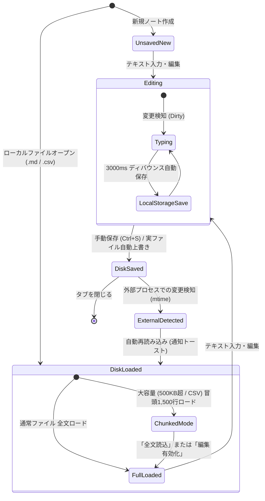

# 機能・技術仕様書 (SPECIFICATION)

[English](docs/en/SPECIFICATION.md) | **日本語版**

## 1. 概要 (Overview)

QuMaEditor は、**Tauri v2**, **Rust**, **React 19**, **TypeScript** で構築された、パフォーマンス最優先のデスクトップ Markdown エディタです。

---

## 2. コア機能一覧 (Core Features)

| 機能分類                   | 機能名                                          | 実装方式 / 技術詳細                                                                                    |
| :------------------------- | :---------------------------------------------- | :----------------------------------------------------------------------------------------------------- |
| **テキスト編集**           | ゼロレイテンシ・タイピング                      | 編集専用モード時のプレビュー完全アンマウント、分割表示時の `useDeferredValue` 非同期解析                |
| **テキスト編集**           | `Ctrl+E` カーソル・フォーカス自動復元           | プレビュー切替時の選択範囲・キャレット位置保持とエディタ即時フォーカス                                  |
| **テキスト編集**           | Markdown 高速自動整形 (`Ctrl+Shift+F`)          | Rust `formatter.rs` による GFM 表組み垂直整列、見出し空行自動挿入、連続空行圧縮（コードブロック保護）  |
| **プレビュー**             | Mermaid ダイアグラム リアルタイム描画           | `mermaid` によるフローチャート・シーケンス図の SVG 描画、ズーム (50%〜600%)、フルスクリーン拡大モーダル |
| **プレビュー**             | CSV インタラクティブプレビュー                  | Rust `parse_csv_preview_native` 高速解析、型自動判別整列（数値:右/日付:中央/文字:左）、ソート、検索     |
| **ファイル I/O**           | 実ファイル直上書き保存 (`Ctrl+S`)               | Rust ネイティブファイル I/O (`write_file_native`, `write_file_bytes_native`)                           |
| **ファイル I/O**           | 大容量チャンク遅延読込 (Streaming)              | `read_file_chunk_native` による 1,500 行単位の分割オンデマンド読み込み                                 |
| **データ保護**             | LocalStorage 二重保護・自動保存                 | 3 秒ディバウンス自動保存、アプリ再起動時の 100% 復元                                                    |
| **外部同期**               | 外部更新自動検知 & 手動再読込 (`F5`)            | OS `mtime` 定期ポーリング・フォーカス復帰時検知、トースト通知、`F5` 手動再読み込み                      |
| **検索**                   | 転置インデックス爆速全文検索                    | Rust `LazyLock<Mutex<Vec<DocSearchInput>>>` による単語単位高速検索、`<mark>` ハイライト                |
| **多言語文字コード**       | UTF-8 / Shift_JIS / EUC-JP 自動判別・相互変換   | `encoding_rs` ネイティブエンジン、改行コード (CRLF / LF) 自動同期                                      |
| **統計・ダッシュボード**   | 詳細統計モーダル (`StatsModal`)                 | 文字数、単語数、行数、読了時間、見出し数、リンク数のリアルタイム集計                                    |
| **差分比較**               | ネイティブ Text Diff                            | Rust `similar` クレートによる行単位差分ビジュアル比較 (`DiffModal`)                                     |

---

## 3. ドキュメント状態遷移＆ライフサイクル (Lifecycle Architecture)

---

## 4. システム動作環境

| 項目       | 詳細                                     |
| :--------- | :--------------------------------------- |
| バージョン | v1.4.0                                   |
| OS         | Windows 10 / 11 (Tauri v2 Native Window) |
| ランタイム | Rust Native Engine + WebView2            |
| フロント   | React 19 + TypeScript 5.8                |
