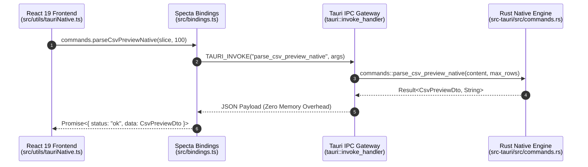

# Tauri v2 開発・IPC 仕様・テストガイド (TAURI_GUIDE)

[English Version](../en/TAURI_GUIDE.md) | **日本語版**

本ドキュメントは、QuMaEditor における **Tauri v2** ネイティブバックエンドのアーキテクチャ、IPC 通信プロトコル、パーミッション設定（Capabilities）、およびテストコード作成ガイドラインです。

---

## 1. Tauri v2 IPC 通信アーキテクチャ

QuMaEditor は、フロントエンド (React 19 + TypeScript) とバックエンド (Rust Engine) 間で高速な **IPC (Inter-Process Communication)** 通信を行っています。



---

## 2. IPC コマンド一覧 & DTO 定義

| コマンド名 | 引数 | 戻り値 | 概要 |
| :--- | :--- | :--- | :--- |
| `detect_and_convert_to_utf8` | `bytes: Vec<u8>` | `Result<EncodingDetectResult>` | バイト配列の文字コード自動判別 & UTF-8 デコード |
| `convert_utf8_to_encoding` | `text: String, target_encoding: String` | `Result<Vec<u8>>` | 指定エンコーディングへのエンコード保存バイト生成 |
| `read_file_native` | `file_path: String` | `Result<EncodingDetectResult>` | ファイルパス指定による高速読込・エンコーディング判定 |
| `read_file_chunk_native` | `file_path: String, offset, length` | `Result<FileChunkResult>` | 10MB+ 大容量ファイルのメモリ分割ストリーミング |
| `index_documents_native` | `docs: Vec<DocSearchInput>` | `Result<bool>` | 転置インデックス検索エンジンへの一括登録 |
| `search_documents_native` | `query: String` | `Result<Vec<SearchResult>>` | 単語・行単位爆速全文検索（マルチバイト文字安全） |
| `compute_text_diff_native` | `old_text: String, new_text: String` | `Result<Vec<TextDiffChunk>>` | `similar` クレートによる行単位差分算出 |
| `parse_markdown_native` | `markdown_text: String` | `Result<String>` | `pulldown-cmark` 高速 Markdown -> HTML 変換 |
| `write_file_bytes_native` | `file_path: String, bytes: Vec<u8>` | `Result<bool>` | バイト配列のネイティブ直書き保存 |
| `write_file_native` | `file_path: String, content: String` | `Result<bool>` | UTF-8 テキストのネイティブ直書き保存 |
| `calculate_text_stats_native` | `text: String` | `Result<TextStatsDto>` | リアルタイム文字数・単語数・読了時間高速算出 |
| `parse_yaml_front_matter_native` | `full_text: String` | `Result<ParsedYamlDocResult>` | YAML Front Matter 高速パース・本文分離 |
| `extract_headings_native` | `markdown_text: String` | `Result<Vec<HeadingItemDto>>` | H1〜H6 目次アウトラインツリー高速抽出 |
| `toggle_task_native` | `markdown_text: String, target_index: u32`| `Result<String>` | タスクチェックボックス状態のトグル・巡回置換 |
| `export_html_full_native` | `title, markdown_text, is_dark` | `Result<String>` | 完全なスタンドアロン HTML ドキュメント生成 |
| `parse_csv_preview_native` | `content: String, max_rows: u32` | `Result<CsvPreviewDto>` | CSV データのゼロコピー行カウント＆クォート対応セル抽出 |
| `get_file_metadata_native` | `file_path: String` | `Result<FileMetadataDto>` | ファイルの存在・最終更新日時 (mtime)・サイズ取得 |
| `open_folder_native` | `file_path: String` | `Result<bool>` | エクスプローラーで対象ファイルを選択表示 |ative` | `full_text: String`                       | `Result<ParsedYamlDocResult>`  | YAML Front Matter 高速パース・本文分離           |
| `extract_headings_native`        | `markdown_text: String`                   | `Result<Vec<HeadingItemDto>>`  | H1〜H6 目次アウトラインツリー高速抽出            |
| `toggle_task_native`             | `markdown_text: String, target_index: u32`| `Result<String>`               | タスクチェックボックス状態のトグル・巡回置換     |
| `export_html_full_native`        | `title, markdown_text, is_dark`           | `Result<String>`               | 完全なスタンドアロン HTML ドキュメント生成       |
| `open_folder_native`             | `file_path: String`                       | `Result<bool>`                 | エクスプローラーで対象ファイルを選択表示         |

---

## 3. Capabilities & セキュリティパーミッション

Tauri v2 では、`src-tauri/capabilities/default.json` にてアプリがアクセス可能なシステム権限（ファイルアクセス、ダイアログ表示、HTTP 通信等）を厳格に定義・管理しています。

```json
{
  "$schema": "../node_modules/@tauri-apps/cli/config.schema.json",
  "identifier": "default",
  "description": "QuMaEditor default permissions",
  "windows": ["main"],
  "permissions": [
    "core:default",
    "dialog:default",
    "fs:default",
    "http:default"
  ]
}
```

---

## 4. Tauri テストコード構築ガイド (Testing Guide)

Tauri アプリケーションのテストは、以下の 3 つのレイヤーで構築・実施されます：

### A. Rust バックエンド単体 & モック統合テスト (`cargo test`)
Tauri の `tauri::test::mock_builder()` を使用して、Tauri AppContext を仮想ビルドし、IPC コマンドのハンドラーが正常にアタッチされるか検証します。

```rust
#[cfg(test)]
mod tests {
    use super::*;

    #[test]
    fn test_tauri_command_mock_invocation() {
        let app = tauri::test::mock_builder().build(tauri::generate_context!());
        assert!(app.is_ok());
    }
}
```

### B. フロントエンド Tauri IPC ブリッジテスト (Vitest / Jest)
`window.__TAURI_INTERNALS__` をモック化し、`src/utils/tauriNative.ts` 内の各関数の振る舞いを検証します。

### C. E2E UI 画面自動テスト (Playwright / WebdriverIO)
Tauri WebView2 ウィンドウを直接起動し、ボタンクリックやテキスト入力をグラフィカルに自動検証します。
