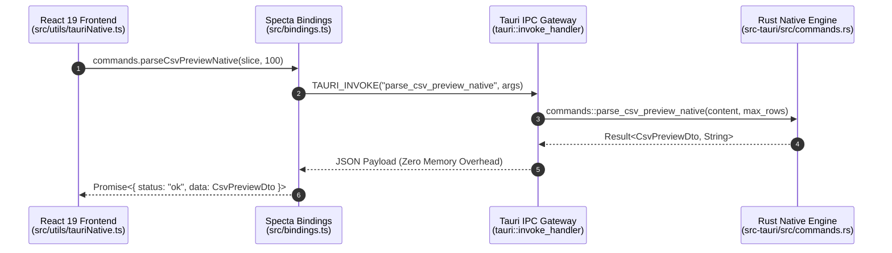

# Tauri v2 IPC 開発・テスト仕様書 (TAURI_GUIDE)

[English](docs/en/TAURI_GUIDE.md) | **日本語版**

## 1. Tauri v2 IPC 通信アーキテクチャ

QuMaEditor は、フロントエンド (React 19 + TypeScript) とバックエンド (Rust Engine) 間で高速な **IPC (Inter-Process Communication)** 通信を行っています。

---

## 2. IPC コマンド一覧 & DTO 定義

| コマンド名                    | 引数                                      | 戻り値                       | 概要                                                                         |
| :---------------------------- | :---------------------------------------- | :--------------------------- | :--------------------------------------------------------------------------- |
| `detect_and_convert_to_utf8`  | `bytes: Vec<u8>`                          | `Result<EncodingDetectResult>` | バイト配列の文字コード自動判別 & UTF-8 デコード                              |
| `convert_utf8_to_encoding`    | `text: String, target_encoding: String`   | `Result<Vec<u8>>`            | 指定エンコーディングへのエンコード保存バイト生成                             |
| `read_file_native`            | `file_path: String`                       | `Result<EncodingDetectResult>` | ファイルパス指定による高速読込・エンコーディング判定                         |
| `read_file_chunk_native`      | `file_path: String, offset, length`       | `Result<FileChunkResult>`    | 10MB+ 大容量ファイルのメモリ分割ストリーミング                               |
| `index_documents_native`      | `docs: Vec<DocSearchInput>`               | `Result<bool>`               | 転置インデックス検索エンジンへの一括登録                                     |
| `search_documents_native`     | `query: String`                           | `Result<Vec<SearchResult>>`  | 単語・行単位爆速全文検索（マルチバイト文字安全）                             |
| `compute_text_diff_native`    | `old_text: String, new_text: String`      | `Result<Vec<TextDiffChunk>>` | `similar` クレートによる行単位差分算出                                       |
| `parse_markdown_native`       | `markdown_text: String`                   | `Result<String>`             | `pulldown-cmark` 高速 Markdown -> HTML 変換                                  |
| `write_file_bytes_native`     | `file_path: String, bytes: Vec<u8>`       | `Result<bool>`               | バイト配列のネイティブ直書き保存                                             |
| `write_file_native`           | `file_path: String, content: String`      | `Result<bool>`               | UTF-8 テキストのネイティブ直書き保存                                         |
| `calculate_text_stats_native` | `text: String`                            | `Result<TextStatsDto>`       | リアルタイム文字数・単語数・読了時間高速算出                                 |
| `parse_yaml_front_matter_native` | `content: String`                      | `Result<YamlFrontMatterDto>` | YAML Front Matter メタデータの高速パース                                     |
| `extract_headings_native`     | `markdown_text: String`                   | `Result<Vec<HeadingItemDto>>` | Markdown からの H1〜H6 見出し目次ツリー抽出                                  |
| `toggle_task_native`          | `markdown_text: String, line_num: usize`  | `Result<String>`             | 指定行タスク項目 (`- [ ]` ↔ `- [x]`) の高速状態トグル                        |
| `export_html_full_native`     | `markdown_text: String, title: String`    | `Result<String>`             | 単体ブラウザ閲覧可能な完全 HTML ドキュメント生成                             |
| `parse_csv_preview_native`    | `content: String, max_rows: usize`        | `Result<CsvPreviewDto>`      | CSV のゼロコピー行カウント・クォート考慮セル抽出                             |
| `format_markdown_native`      | `markdown_text: String`                   | `Result<String>`             | 表組み垂直整列・過剰空行圧縮・見出し空行自動挿入のネイティブ自動整形         |
| `render_markdown_html_native` | `markdown_text: String, is_dark: bool`    | `Result<String>`             | syntect プログラミング構文ハイライト付き高速 HTML レンダリング               |
| `get_file_metadata_native`    | `file_path: String`                       | `Result<FileMetadataDto>`    | ファイル存在有無、最終更新日時 (`mtime`)、ファイルサイズの高速取得           |
| `open_folder_native`          | `file_path: String`                       | `Result<bool>`               | 対象ファイルをハイライト選択した状態で Windows エクスプローラーを安全オープン |
